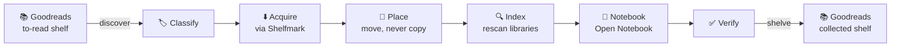

<div align="center">

# 📚 Goodreads-Pipeline

**Watches your Goodreads _to-read_ shelf, downloads each book, and files it into Kavita, BookLore,
Grimmory, Audiobookshelf and Open Notebook, ready to read, listen to, and take notes on.**

<sub>Self-hosted · one container · never makes a second copy of a file · no frontend build step</sub>

[](docs/VERSION.md)
[](https://github.com/ohmzi/goodreads-pipeline/commits/develop)
[](LICENSE)

[Features](#-features) · [Quick start](#-quick-start) · [Security](#-security) · [Docs](#-documentation) · [Report a bug](https://github.com/ohmzi/goodreads-pipeline/issues)

</div>

---

## 👋 What is it?

Add a book to your Goodreads *to-read* shelf and walk away. The pipeline finds and downloads the
ebook and audiobook, files them where your library apps expect them, adds the ebook to the matching
Open Notebook notebook, checks that every service can really see it, and only then moves the book
off your to-read shelf.

- **📁 One copy per book.** Every placement is a same-filesystem move, never a copy, so a duplicate
  can't happen.
- **✅ Proves it before it commits.** Each library is checked before anything irreversible happens
  on Goodreads.
- **🛡️ Rides out outages.** A per-service circuit breaker holds books while a service is down,
  instead of failing hundreds of them.
- **🚨 Says what's wrong.** Failures are grouped by cause, each with a plain-language next step.

---

## ✨ Features

### 📖 Tracks your shelf

- Reads *to-read* through a saved browser session, keyed on the Goodreads id, so re-runs never
  duplicate.
- Reconciles your shelves against Goodreads **every 6 hours** and resets anything that drifted.
- Moves finished books onto *collected-pdf*, *collected-audiobook*, or both, creating the shelf if
  needed.

### ⬇️ Finds the right release

- Filters out wrong categories, sizes, and video releases **before** ranking, so a film can't be
  queued as an audiobook.
- Falls through to the next-best release (up to **4** per book) instead of failing on a dead one.
- Won't start an audiobook download below a free-space floor you set.

### 🏷️ Files every book in exactly one place

- Four genre sources (Goodreads, OpenLibrary, Google Books, the epub itself), with the title as a
  last resort.
- Anything that matches no rule is flagged **needs review** instead of being misfiled.
- Ebooks go to `<Category>/Author - Title (Year)/` and audiobooks to `Author/Title/`. An existing
  file is never overwritten.

### 🔍 Indexes, then checks

- Rescans Kavita, BookLore, Grimmory, and Audiobookshelf. Nothing is imported or uploaded.
- Attaches each ebook to its category's Open Notebook notebook by path, so no second copy is stored.

### 🛡️ Stays healthy on its own

- Stops sending work to a service after **3** consecutive failures, probes until it's back, and
  gives each book a **24-hour** grace for transient faults.
- Checks every service's credentials every **5 minutes** with a real, authenticated call.
- Shows a banner on every page when a credential breaks, with a link to fix it.

> [!TIP]
> Every behaviour, with its numbers and edge cases, is in **[docs/FEATURES.md](docs/FEATURES.md)**.
> Each stage is covered in depth in [docs/PIPELINE.md](docs/PIPELINE.md).

---

## 🔗 How it works



Two periodic jobs run alongside: `discover` reads the shelf, and `reconcile` checks what's recorded
against what Goodreads actually shows.

---

## 🚀 Quick start

```bash
git clone https://github.com/ohmzi/goodreads-pipeline.git goodreads
cd goodreads
cp .env.example .env
python3 -c "import secrets; print(secrets.token_urlsafe(48))"   # paste into GOODREADS_SECRET_KEY
chmod 600 .env
docker compose up -d --build
docker compose exec goodreads python -m app.cli set-password you --generate
```

Open `http://<host>:8091`, sign in, and connect your services on the Settings page. There's no
default account. Put your library paths and any extra networks in a git-ignored
`docker-compose.override.yml`.

> [!WARNING]
> By default, port `8091` listens on every interface, and Docker's published ports bypass ufw.
> Narrowing it with `PUBLISH_HOST` is worth doing, but a wrong value makes the app refuse every
> request. Read **[SETUP.md → Start it](docs/SETUP.md#2-start-it)** first.

<details>
<summary><b>💻 Maintenance CLI</b></summary>

```bash
python -m app.cli report            # what completed, what failed, and why
python -m app.cli repair            # fix notebook links and stuck stages (dry run)
python -m app.cli audit             # duplicate audiobooks and titles in two places
python -m app.cli rename            # tidy loose audiobooks into Author/Title
python -m app.cli reclassify        # re-run classification over the library
python -m app.cli backfill-genres   # re-resolve genres and re-categorise
python -m app.cli forget-session    # drop the stored Goodreads session + browser profile
```

`report` and `audit` only read. `repair`, `rename`, `reconcile`, and `reclassify` change nothing
without `--apply`. `backfill-genres` and `forget-session` write immediately. See
[OPERATIONS.md](docs/OPERATIONS.md#the-maintenance-cli).

</details>

---

## 🔌 Integrations

| Service            | Role                                                        | Stage                  |
|--------------------|-------------------------------------------------------------|------------------------|
| **Goodreads**      | The shelf itself: read by `discover`, written by `shelve`   | `discover`, `shelve`   |
| **Shelfmark**      | Searches indexers and downloads ebooks and audiobooks       | `acquire`              |
| **Kavita**         | Ebook library, rescanned after placement                    | `index`, `verify`      |
| **BookLore**       | Ebook library, rescanned after placement                    | `index`, `verify`      |
| **Grimmory**       | Ebook library, rescanned after placement                    | `index`, `verify`      |
| **Audiobookshelf** | Audiobook library, rescanned after placement                | `index`, `verify`      |
| **Open Notebook**  | Receives each ebook as a source in its category's notebook  | `notebook`, `verify`   |

Settings each service needs, and the ones that caused trouble, are in
[INTEGRATIONS.md](docs/INTEGRATIONS.md).

---

## ⚙️ Configuration

- **`.env`** holds only what must exist before the database can be read, such as the secret key.
- **Service credentials** are entered on the Settings page and stored Fernet-encrypted in the
  database.
- **`app/categories.yml`** maps genres to a folder and a notebook. `/data/categories.yml` overrides
  it and is re-read on every classification, so edits need no restart.

Every variable, credential, and path mapping: [CONFIGURATION.md](docs/CONFIGURATION.md).

---

## 🛠️ Built with

<div align="center">


<br/>


</div>

SQLite (WAL) in one file with no ORM. Credentials are encrypted with `cryptography` (Fernet) and
passwords hashed with scrypt. The UI is served straight from `app/static/`, with no framework and no
build step. The image is built on Playwright's own, so Chromium's version always matches.

---

## 🔐 Security

- **Passwords** are hashed with scrypt and compared in constant time.
- **Sessions** carry a password epoch, so changing your password or signing out ends every session
  on every device.
- **Failed logins** slow down progressively by username *and* address. There's no lockout, so no
  one can shut you out of your own UI.
- **Every credential** is Fernet-encrypted behind a secret key of at least 32 characters, and the
  data volume is owner-only.
- **Cross-site requests are refused on the server.** Calls to your services refuse redirects and cap
  response sizes.
- **The noVNC desktop has no published port.** It's reachable only through a WebSocket that checks
  origin and session.

> [!CAUTION]
> This is the most sensitive service you'll run. It holds the key to every stored credential and a
> browser signed in to your real account. Traffic is plain HTTP unless something terminates TLS in
> front. Read **[SECURITY.md](docs/SECURITY.md)** (threat model, reverse proxies, known limits)
> before exposing it beyond a host you control.

---

## ❓ FAQ

<details>
<summary><b>Why is the Goodreads login manual?</b></summary>
<br/>

Goodreads removed its public API in 2020, then removed public shelf pages, and `/user/sign_in` is
now a stub that hands off to Amazon's sign-in flow. There's no form to post a password to, so every
maintained Goodreads tool reuses a persistent browser session instead.

This one runs Chromium on a virtual display inside its own container and streams it to the login
page over noVNC. You sign in once and the cookies are saved. Everything after that runs over plain
HTTP with them. When the session eventually expires, the UI tells you, and you sign in again.

</details>

<details>
<summary><b>Will it ever duplicate a file?</b></summary>
<br/>

No. Every placement is an `os.rename` within one filesystem. A move that would cross filesystems
raises an error instead of falling back to a copy, and each library app only rescans a tree it
already mounts. [ARCHITECTURE.md](docs/ARCHITECTURE.md) explains why.

</details>

---

## 📚 Documentation

| Document                                          | What's in it                                                                  |
|---------------------------------------------------|-------------------------------------------------------------------------------|
| 🚀 [SETUP.md](docs/SETUP.md)                      | Install, mounts and networks, first login, first run, running without Docker |
| ✨ [FEATURES.md](docs/FEATURES.md)                | Every behaviour with its numbers and edge cases                               |
| ⚙️ [CONFIGURATION.md](docs/CONFIGURATION.md)      | Every variable, credential, and path mapping; `categories.yml`; genres        |
| 🔐 [SECURITY.md](docs/SECURITY.md)                | What's enforced and where, threat model, reverse proxies, known limits        |
| 🔧 [OPERATIONS.md](docs/OPERATIONS.md)            | Upgrading, backup and restore, the maintenance CLI, health, troubleshooting   |
| 🏗️ [ARCHITECTURE.md](docs/ARCHITECTURE.md)        | Components, module map, database, concurrency, the path namespace problem     |
| 🔄 [PIPELINE.md](docs/PIPELINE.md)                | Every stage, the scheduler, retries, the service breaker                      |
| 🔌 [INTEGRATIONS.md](docs/INTEGRATIONS.md)        | The surrounding services and the settings each one needs                      |
| 🌐 [API.md](docs/API.md)                          | The HTTP API                                                                  |
| 📝 [VERSION.md](docs/VERSION.md)                  | Release notes                                                                 |

---

## 🤝 Contributing

- 🐞 **Found a bug?** [Open an issue](https://github.com/ohmzi/goodreads-pipeline/issues).
- 💡 **Have an idea?** [Suggest it](https://github.com/ohmzi/goodreads-pipeline/issues).
- 🔒 **Security concern?** Read [SECURITY.md](docs/SECURITY.md) first, and don't post secrets or
  host details in a public issue.

---

## 📄 License

[Apache-2.0](LICENSE) © 2026 Omar

Goodreads-Pipeline is an independent project. It is not affiliated with, endorsed by, or sponsored by
Goodreads or Amazon.

<div align="center">

<sub>Read more, file less · <a href="#top">Back to top ↑</a></sub>

</div>
